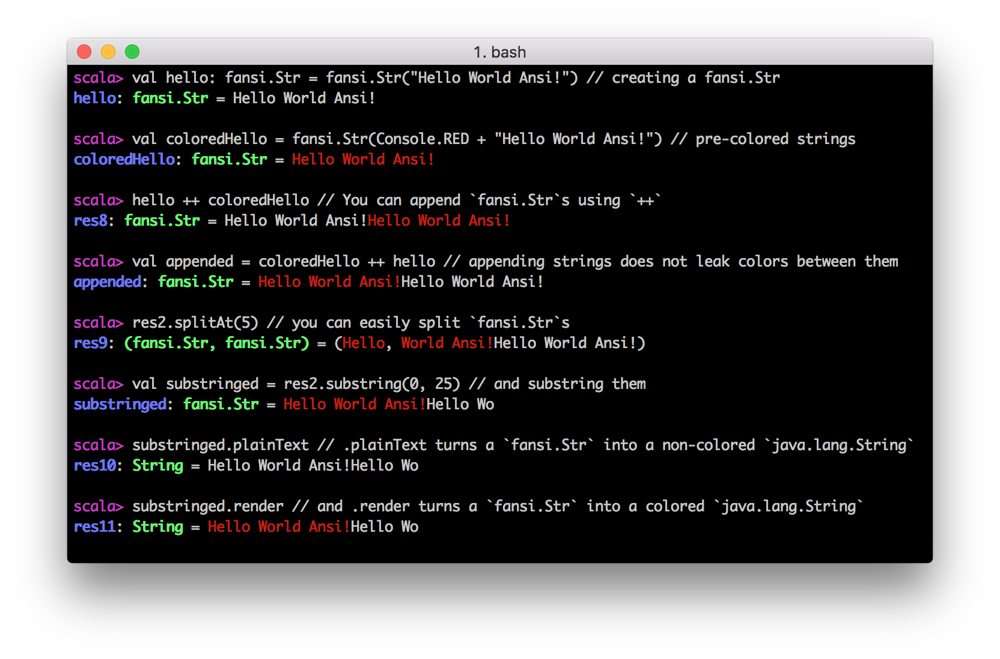
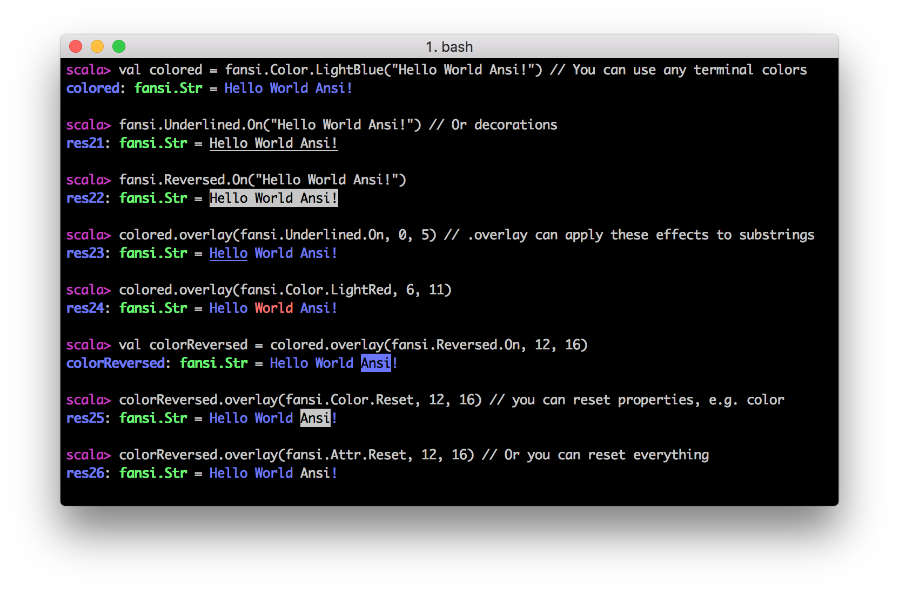
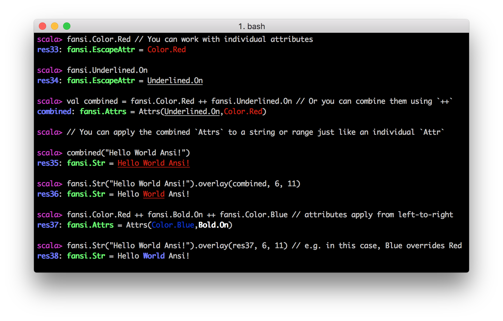

Fansi 0.1.0
===========

```scala
"com.lihaoyi" %% "fansi" % "0.1.0"
"com.lihaoyi" %%% "fansi" % "0.1.0" // Scala.js
```

Fansi is a Scala library to make it easy to deal with colored fansi Ansi 
strings within your command-line programs. 

While "normal" use of Ansi escapes with `java.lang.String`, you find yourself 
concatenating colors:

```scala
val colored = Console.RED + "Hello World Ansi!" + Console.RESET
```

To build your colored string. This works the first time, but is error prone
on larger strings: e.g. did you remember to put a `Console.RESET` where it's
necessary? Do you need to end with one to avoid leaking the color to the entire
console after printing it?.

Furthermore, some operations are fundamentally difficult or error-prone with
this approach. For example,

```scala
val colored: String = Console.RED + "Hello World Ansi!" + Console.RESET

// How to efficiently get the length of this string on-screen? We could try
// using regexes to remove and Ansi codes, but that's slow and inefficient. 
// And it's easy to accidentally call `colored.length` and get a invalid length
val length = ??? 

// How to make the word `World` blue, while preserving the coloring of the 
// `Ansi!` text after? What if the string came from somewhere else and you 
// don't know what color that text was originally?
val blueWorld = ??? 

// What if I want to underline "World" instead of changing it's color, while
// still preserving the original color?
val underlinedWorld = ???

// What if I want to apply underlines to "World" and the two characters on 
// either side, after I had already turned "World" blue?
val underlinedBlue = ???
```

While simple to describe, these tasks are all error-prone and difficult to
do using normal `java.lang.String`s containing Ansi color codes.

With Fansi, doing all these tasks is simple, error-proof and efficient:

```scala
val colored: fansi.Str = fansi.Color.Red("Hello World Ansi!")
// Or fansi.Str("Hello World Ansi!").overlay(fansi.Color.Red) 

val length = colored.length // Fast and returns the non-colored length of string

val blueWorld = colored.overlay(fansi.Color.Blue, 6, 11)

val underlinedWorld = colored.overlay(fansi.Underlined.On, 6, 11)

val underlinedBlue = blueWorld.overlay(fansi.Underlined.On, 4, 13)
```

And it just works:


Why Fansi?
----------

Unlike normal `java.lang.String`s with Ansi escapes embedded inside,
`fansi.Str` allows you to perform a range of operations in an efficient
manner:

- Extracting the non-Ansi `plainText` version of the string

- Get the non-Ansi `length`

- Concatenate colored Ansi strings without worrying about leaking
  colors between them

- Applying colors to certain portions of an existing `fansi.Str`,
  and ensuring that the newly-applied colors get properly terminated
  while existing colors are unchanged

- Splitting colored Ansi strings at a `plainText` index

- Rendering to colored `java.lang.String`s with Ansi escapes embedded,
  which can be passed around or concatenated without worrying about
  leaking colors.

These are tasks which are possible to do with normal `java.lang.String`,
but are tedious, error-prone and typically inefficient. `fansi.Str`
allows you to perform these tasks safely and easily.

Fansi was originally a part of the [Ammonite REPL](http://www.lihaoyi.com/Ammonite/),
but is now a standalone zero-dependency library anyone can use if they want
to easily and efficiently deal with colored Ansi strings.

Using Fansi
-----------

The main operations you need to know are:

- `fansi.Str(raw: CharSequence): fansi.String`, to construct colored
  Ansi strings from a `java.lang.String`, with or without existing Ansi
  color codes inside it.

- `fansi.Str`, the primary data-type that you will use to pass-around
  colored Ansi strings and manipulate them: concatenating, splitting,
  applying or removing colors, etc.



- `fansi.Attr`s are the individual modifications you can make to an 
  `fansi.Str`'s formatting. Examples are: 
    - `fansi.Bold.{On, Off}`
    - `fansi.Reversed.{On, Off}`
    - `fansi.Underlined.{On, Off}` 
    - `fansi.Color.*` 
    - `fansi.Back.*` 
    - `fansi.Attr.Reset`
  


- `fansi.Attrs` represents a group of zero or more `fansi.Attr`s. 
  These that can be passed around together, combined via `++` or applied 
  to `fansi.Str`s all at once. Any individual `fansi.Attr` can be used 
  when `fansi.Attrs` is required, as can `fansi.Attrs.empty`. 



- Using any of the `fansi.Attr` or `fansi.Attrs` mentioned above, e.g. 
  `fansi.Color.Red`, using `fansi.Color.Red("hello world ansi!")` to create a 
  `fansi.Str` with that text and color, or 
  `fansi.Str("hello world ansi!").overlay(fansi.Color.Blue, 6, 11)`

- `.render` to convert a `fansi.Str` back into a `java.lang.String` with all
  necessary Ansi color codes within it
  
Changelog
---------

### 0.1.0

- First release
